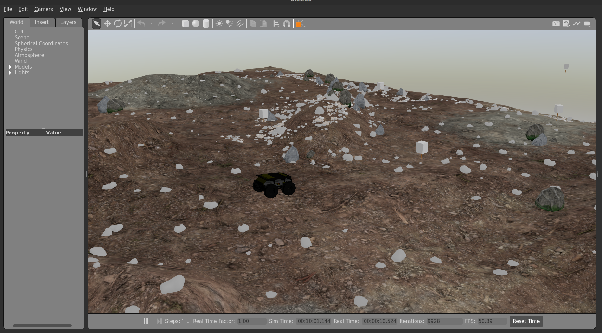
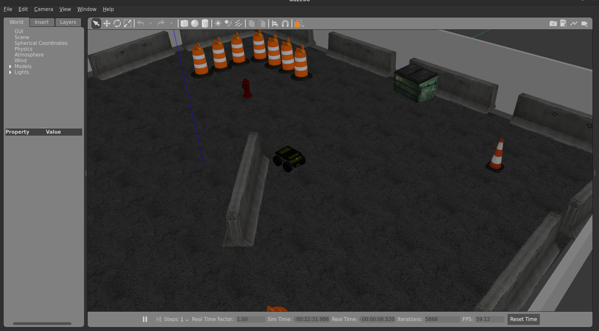
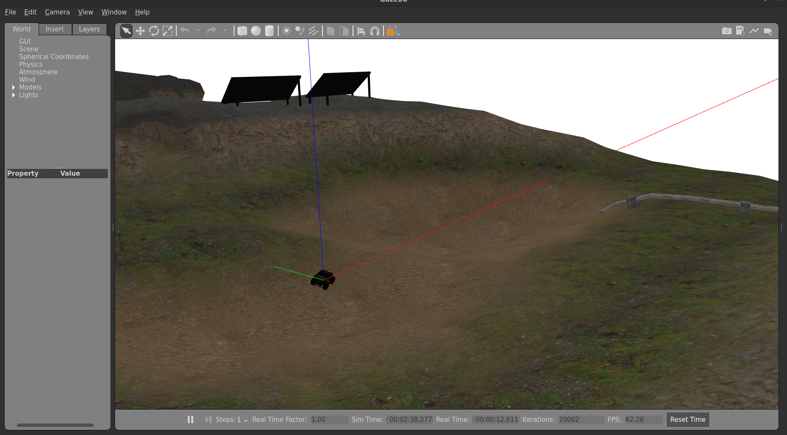

# A dockerised simulation respository for simulating the Scout / Husky on Gazebo classic.
Run ```cd <cloned_repo>```

1. ```sudo docker pull osrf/ros:humble-desktop-full-jammy```
2. ```sudo docker build -t scout_husky_gazebo_docker .```
3. ```sudo docker compose run scout_gazebo_sim```
4. Once inside the container run ```cd ros2_ws/ && colcon build --symlink-install```
5. ```source ~/.bashrc```
6. To setup gazebo for the first time, run ```ros2 launch scout_gazebo start_world.launch.py```. This can quite a bit of time (Patience is key :p). Once the Gazebo GUI is open and you can see, move around and interact with the world, you can close this launch file. Gazebo is set for future use.
7. To launch the robot simulation after running (6), run ```ros2 launch scout_gazebo scout_simu.launch.py```
8. You should be able to teleop the robot through the teleop window.

# Important information
The namespace of the robot is currently set to ```scout_2```. There is a bug in the differential_drive_controller of ros2_control due to which direct change of namespaces is not possible. Hence it is built from source as a temporary fix to this issue.

The ```ROS_DOMAIN_ID``` is set to 55 in the ```.bashrc```




